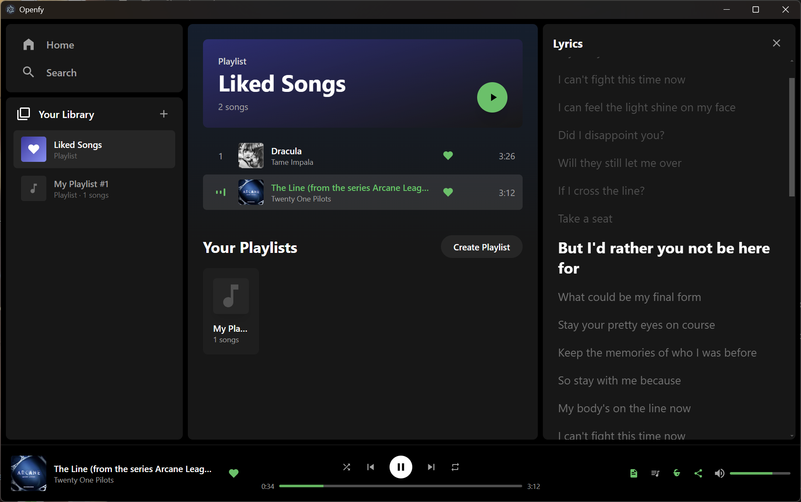

<div align="center">

# Openfy

### Free, open-source music streaming for desktop

[](LICENSE)
[](https://electronjs.org)
[](https://react.dev)
[](https://nodejs.org)

**Search anything. Play instantly. No ads, no accounts, no limits.**

Openfy is a Spotify-inspired desktop music player that streams audio for free using open APIs. Built with Electron, React, and Express.

<br>



<sub>Liked Songs playlist with real-time synced lyrics and dynamic theme</sub>

---

</div>

## Features

**Playback**
- Instant search and play - millions of tracks via Piped & InnerTube
- Gapless queue with Play Next / Add to Queue
- Crossfade between tracks (3-second overlap)
- Shuffle, repeat (one/all), and keyboard shortcuts (Space to play/pause)

**Synced Lyrics**
- Real-time synced lyrics via LRCLIB (no API key needed)
- Current line highlighted and auto-scrolled
- Falls back to plain lyrics when synced unavailable

**Dynamic Themes**
- Album art dominant color extracted in real-time
- Gradient background adapts to whatever's playing

**Library**
- Create and manage playlists (stored locally in SQLite)
- Like/unlike tracks with one click
- Drag-to-reorder queue

**Desktop Integration**
- System tray with media controls (play/pause, next, previous)
- Minimize to tray instead of closing
- OS media controls via Media Session API (taskbar, lock screen)
- Discord Rich Presence - shows what you're listening to

## Tech Stack

| Layer | Technology |
|-------|-----------|
| Frontend | React 18, Tailwind CSS, Vite |
| Backend | Express, better-sqlite3, youtubei.js |
| Desktop | Electron 33 |
| Audio Sources | Piped API, InnerTube (iOS client) |
| Lyrics | LRCLIB |
| Social | Discord RPC |

## Getting Started

### Prerequisites

- [Node.js](https://nodejs.org) 18+
- npm

### Install & Run

```bash
# Clone
git clone https://github.com/FarisElshammouty/openfy.git
cd openfy

# Install dependencies
npm run install:all

# Start development server
npm run dev
```

Open [http://localhost:5173](http://localhost:5173) in your browser.

### Build Desktop App

```bash
# Build portable Windows exe
npm run electron:portable

# Build Windows installer
npm run electron:build
```

Output goes to `dist-electron/`.

## Project Structure

```
openfy/
├── client/             # React frontend (Vite)
│   └── src/
│       ├── components/ # UI components (Player, Search, Lyrics, Queue, etc.)
│       ├── context/    # PlayerContext (audio engine, queue, crossfade)
│       └── api.js      # API client
├── server/             # Express backend
│   ├── index.js        # Routes, Piped/InnerTube streaming proxy
│   ├── db.js           # SQLite database
│   └── discord.js      # Discord RPC
└── electron/           # Electron main + preload
```

## Configuration

| Environment Variable | Default | Description |
|---------------------|---------|-------------|
| `PORT` | `3001` | Backend server port |
| `PIPED_API` | `https://api.piped.private.coffee,...` | Comma-separated Piped instance URLs |

## License

MIT
